# Waahchak: An Ebook Web Application

## Introduction

Waahchak is a comprehensive ebook web application designed for book enthusiasts. It offers a platform for users to browse, buy, and sell books conveniently, as well as an administrative portal for managing the ebook collection and orders. The app ensures a smooth user experience with features like cart management, secure authentication, and profile customization.

## Features

- **Home Page:** Showcases sections for New Books, Old Books, and Recent Books, dynamically displaying books based on their category and upload date.
  
- **Recent Books:** Lists all books (new and old) uploaded by users and sellers in chronological order.

- **New Books Page:** Displays only books uploaded by the admin, categorized as "new books".

- **Old Books Page:** Shows all old books uploaded by both sellers and admin users. Users can view details and seller information.

- **Book Details**
    - ***New Books:*** Options include "Add to Cart" for adding books to the cart and "View Details" for viewing book information.
    - ***Old Books:*** A "View Details" button reveals seller details and additional book information.

- **Cart Page:** Displays all books added by the user, along with details and the user’s address for proceeding to payment. Shows a summary once the order is successfully placed.

- **User Panel:**
    - Allows users to sell old books, manage (edit/delete) their listings.
    - Includes a profile management section for updating user details and address information.
    - Displays order history and provides access to a help center.

- **Admin Panel:**
    - ***Add Books:*** Admin can add new books to the collection.
    - ***All Books:*** Admin can view, edit, or delete any book.
    - ***All Orders:*** Displays all user orders with full control for the admin.

- **Authentication:** Features secure login and signup pages using Bcrypt for password hashing, ensuring secure user authentication and validation.

## Technologies Used

### Frontend

- **JSP (JavaServer Pages):** For dynamic web content generation.
- **JavaScript:** To enhance interactivity and client-side validation.
- **CSS:** For styling and layout design.
- **Bootstrap:** To create responsive and modern user interfaces.

### Backend

- **Java:** Core programming language for the application logic.
- **JDBC (Java Database Connectivity):** For connecting and executing queries with the MySQL database.
- **Servlet:** To handle HTTP requests and responses.
- **JSTL (JavaServer Pages Standard Tag Library):** To simplify JSP development and manage data presentation.

### Database

- **MySQL Workbench:** For database design, management, and querying.

### Security

- **Bcrypt:** Used for password hashing to ensure secure user authentication

## Demo

### Video Demo

Watch the full demo of GastroGrid in action:

[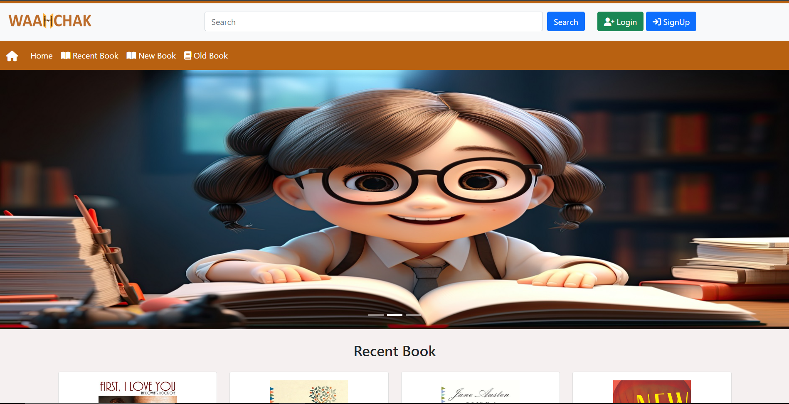](https://youtu.be/7S_HJTyJFLk)

### Screenshots

#### Login Page

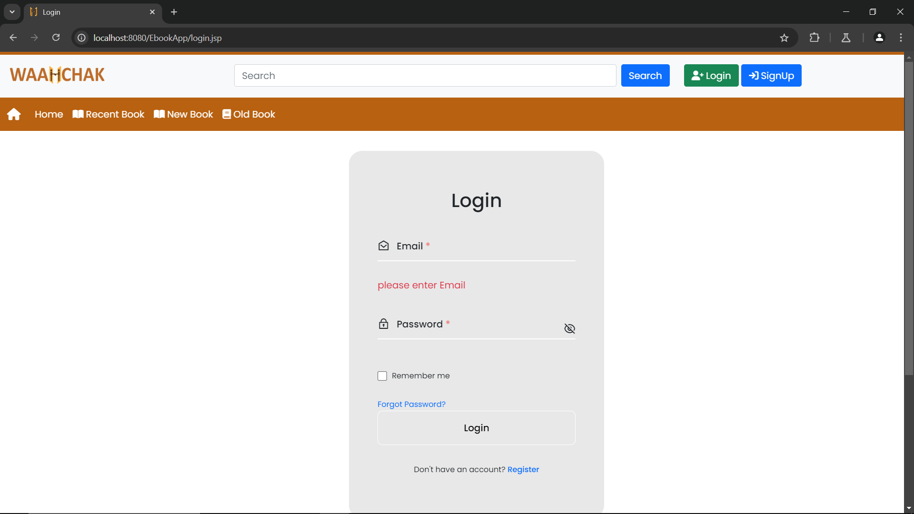

#### SignUp Page

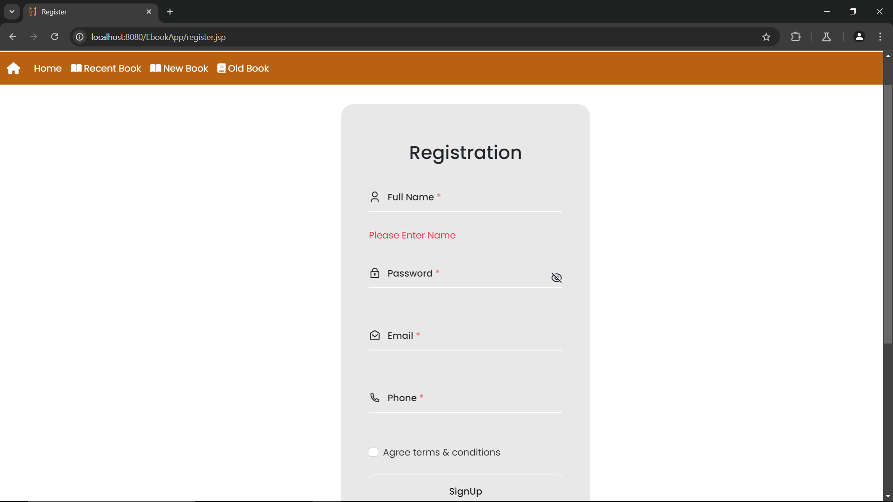

#### Home Page

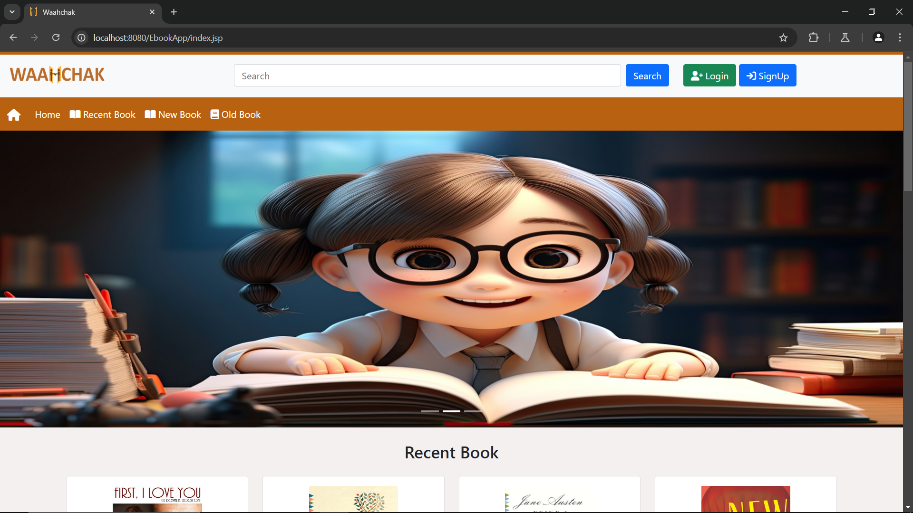

#### Recent Books

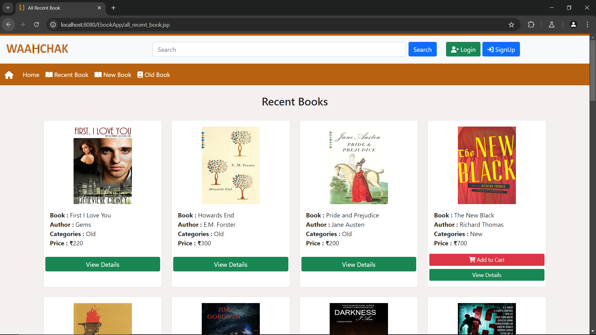

#### New Books

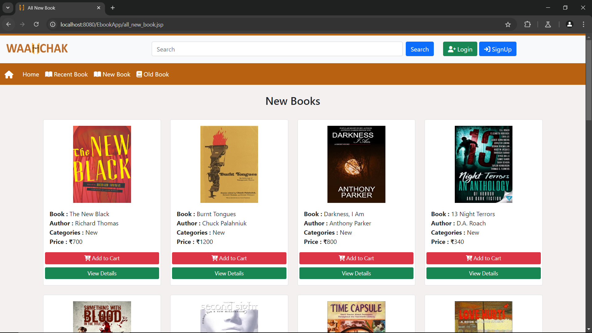

#### Old Books

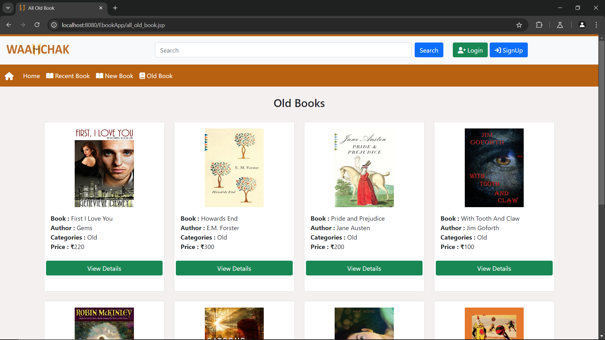

#### User Dashboard
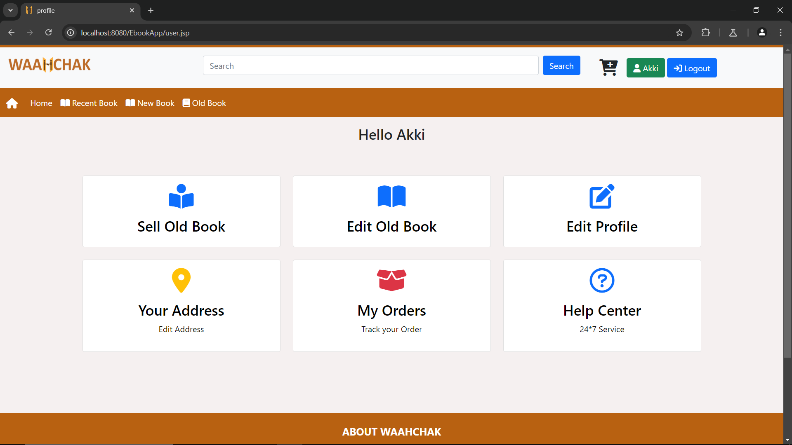

#### Checkout Page

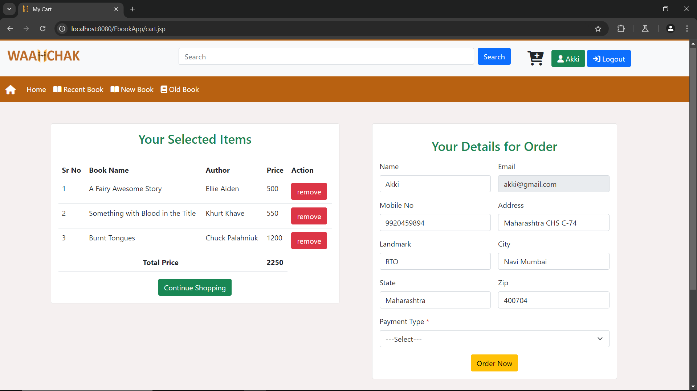

### Confirmation page

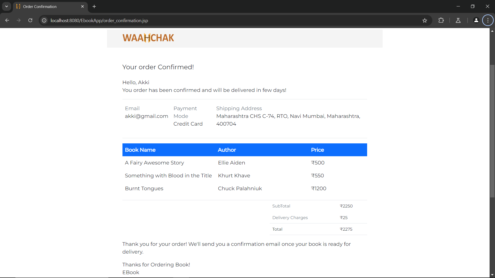

#### Admin Dashboard

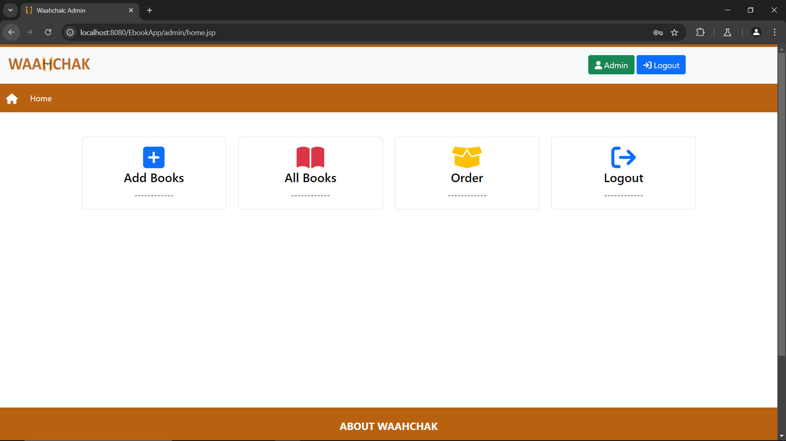

## Contact

For any questions, feedback, or support, please contact:

- **Akshay Barge:** [akshaybarge315@gmail.com](mailto:akshaybarge315@gmail.com)
